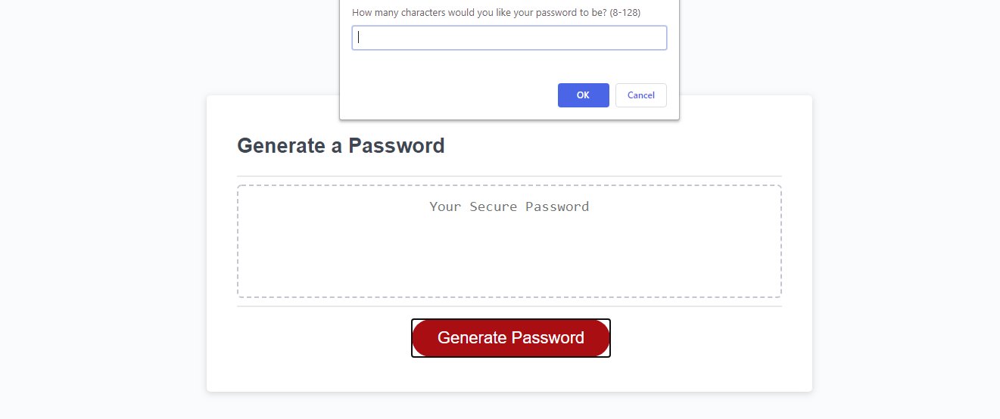
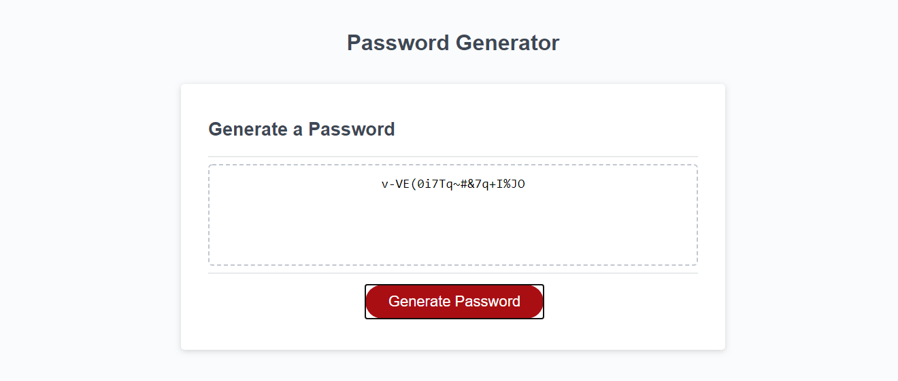

# Password Generator

## Description
Password generator allows you to generate a password bewteen 8-128 characters. The generated characters can be symbols, numbers as well as uppercase and lowercase letters. The type and amount of characters contained is based on the informatiion obtained by the requestor. 

## Language/Technology Used
* HTML5
* CSS
* JavaScript

 ## Mock-Up

## Deployed Link
https://jannverduzco.github.io/password-generator/

## GitHub Repository Link
https://github.com/jannverduzco/password-generator